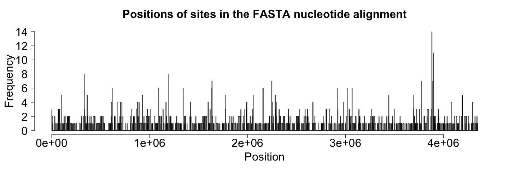
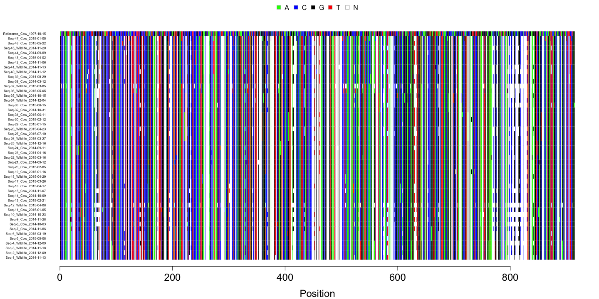
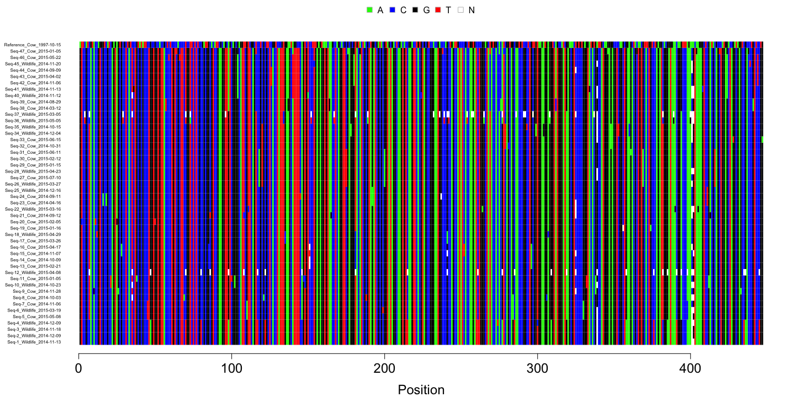
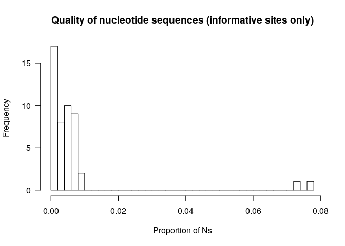
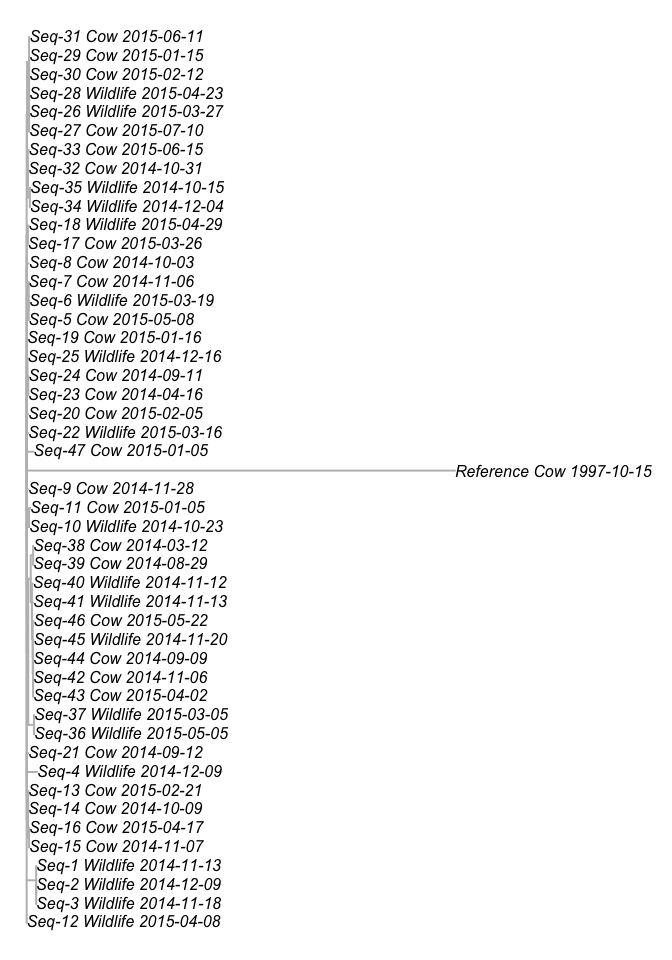
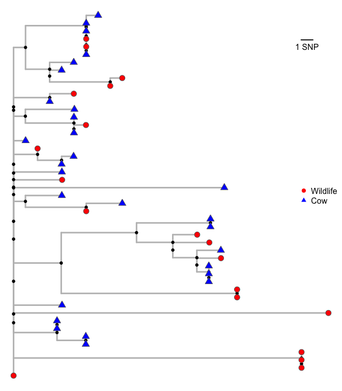

---

## Introduction

Pathogens threaten the health of people and animals. Understanding pathogen transmission can help us understand how to control it.

Today we are going to be working with genomic data for the pathogen *Mycobacterium bovis*. *M. bovis* causes bovine tuberculosis in cattle and many other species. It costs millions to control. How can genomic data help?

We'll use some genomic data sourced from infected cattle and wildlife to try and understand the role of wildlife. Wildlife species have been shown to harbour and transmit infection to cattle, we want to know if that is the case here.

### Learning objectives

- To load a FASTA nucleotide sequence file
- To construct and plot a phylogenetic tree
- Developed an understand and enthusiasm for github
- Been introduced to constructing an R package

---

## Step 1: Set your working directory

I have created a working directory folder for us, you can download it from [here](https://github.com/JosephCrispell/PathogenGenomicsWorkshop/archive/master.zip).

Unzip the folder and place it on your Desktop. Then we can set this folder to our working directory using the following code:


```r
# Set your working directory
setwd(file.path("~", "Desktop", ""))
```

> QUESTION:<br>
> 1. What is a working directory?

---

## Step 2: Getting started

Firstly, we are going to install some R packages that we'll use throughout the workshop. The packages are `ape`, `phangorn` and `PathogenGenomicsWorkshopPackage`. The first two packages are commonly used for phylogenetic analyses in R. The `PathogenGenomicsWorkshopPackage` is an R package that we have specifically developed for this course. It has a few functions that we'll use later on.

Here is how to install the R packages:


```r
# Installing the 'ape' package
install.packages("ape", repos="https://cloud.r-project.org")

# Installing the 'phangorn' package
install.packages("phangorn", repos="https://cloud.r-project.org")

# Installing the 'pathogenGenomicsPackage' package
install.packages("devtools", repos="https://cloud.r-project.org")
devtools::install_github("JosephCrispell/pathogenGenomicsWorkshop")
```

Once that is done, we can load the packages using the following code:


```r
# Load the required libraries
library(ape) # For reading in sequence
library(phangorn) # For testing substitution models and building and plotting the phylogeny
library(pathogenGenomicsWorkshop) # Our custom package for the current course
```

We are also going to create a variable that stores today's date - we'll use this when we are creating files. Here's how:


```r
# Get the current date
today <- format(Sys.Date(), "%d-%m-%y")
```

> QUESTION:<br>
> 1. Why create/use R packages?

---

## Step 3: Reading in the FASTA file

A FASTA file stores one or multiple nucleotide sequences. Our FASTA file stores the nucleotides present at a subset of genomic positions for `48` different *M. bovis* genomes. Read it in using the following code:

```r
# Read in the FASTA file
fastaFile <- system.file("extdata", "Wicklow_Mbovis.fasta", package = "pathogenGenomicsWorkshop")
nucleotideAlignment <- read.dna(fastaFile, format = "fasta", as.character=TRUE)
nucleotideAlignment <- toupper(nucleotideAlignment) # Convert the nucleotides to upper case
```

Notice by default nucleotides are stored in lower case, we don't like that so we've converted them to uppercase.

> QUESTIONS:<br>
> 1. Can anyone tell me what class of variable we have stored the sequences in?<br>
> 2. Do we have `48` sequences?<br>
> 3. How many positions are in the FASTA file?<br>

We also have a file that tells us which position on the *M. bovis* genome each position in the FASTA file relates to. Let's read that in:

```r
# Read in the genome positions
positionsFile <- system.file("extdata", "fastaPositions.txt", package = "pathogenGenomicsWorkshop")
genomePositions <- read.table(positionsFile, header=TRUE)
```

> EXERCISE:<br>
> 1. Create the plot below:<br>



The FASTA file contains only the variant positions on the reference genome based on the whole genome sequencing data for the 48 *M. bovis* isolates. 

> QUESTION:<br>
> 1. Why might there be areas of the genome with more variants?<br>

Now, let's take a quick look at the FASTA file:

```r
plotFASTA(nucleotideAlignment, pdfFileName=paste0("FullNucleotideAlignment_", today, ".pdf"))
```



---

## Step 4: Cleaning up the FASTA file

There are a lot of sites that aren't informative. They are the same in all the `48` sequences. We can clean up the alignment using the following code:


```r
# Count the nucleotides at each site in the alignment
nucleotideCountsAtEachSite <- countNucleotidesAtEachSite(nucleotideAlignment)

# Identify the uninformative sites
uninformativeSites <- which(nucleotideCountsAtEachSite < 2)

# Create a new nucleotide alignment without the uninformative sites
nucleotideAlignmentInformative <- nucleotideAlignment[, -uninformativeSites]
informativeGenomePositions <- genomePositions[-uninformativeSites, ]
```

> QUESTION:<br>
> 1. What does line 5 in the above code block do?<br>

Now, let's take another look at the alignment, how has it changed?


```r
plotFASTA(nucleotideAlignmentInformative, 
          pdfFileName=paste0("InformativeSitesAlignment_", today, ".pdf"))
```


> QUESTIONS:<br>
> 1. Can anyone guess what the nucleotide sequence at the top of the plot is?<br>
> 2. If we remove this sequence and then remove uninformative sites, how does the alignment change?<br>

---

## Step 5: Extract the sequence metadata from the IDs

As you will have seen the sequence labels contain some information about our sequences. Let's extract these data and store them in a `data.frame`:


```r
# Extract metadata from sequences
sequenceInfo <- getSequenceInfoFromNames(rownames(nucleotideAlignment))

# Take a quick look at the metadata
head(sequenceInfo)
```

```
##                        Name  Species SamplingDate
## 1 Seq-1_Wildlife_2014-11-13 Wildlife   2014-11-13
## 2 Seq-2_Wildlife_2014-12-09 Wildlife   2014-12-09
## 3 Seq-3_Wildlife_2014-11-18 Wildlife   2014-11-18
## 4 Seq-4_Wildlife_2014-12-09 Wildlife   2014-12-09
## 5      Seq-5_Cow_2015-05-08      Cow   2015-05-08
## 6 Seq-6_Wildlife_2015-03-19 Wildlife   2015-03-19
```

> EXERCISE:<br>
> 1. Calculate the number of samples sourced from wildlife and the number sourced from cattle<br>

---

## Step 6: Examine the quality of the nucleotide sequences

We don't have extensive data on the quality of our nucleotide sequences available but we can learn something about their quality from the nucleotide alignment. There are some `N`s in the alignment. 

> QUESTION:<br>
> 1. What do `N`s in a nucleotide alignment mean?<br>

Let's calculate the proportion of nucleotides in each sequence that are `N`s:

```r
# Calculate the proportion of Ns for each sequence
proportionNsInInformativeSites <- calculateProportionNsOfEachSequence(nucleotideAlignmentInformative)
```

> EXERCISE:<br>
> 1. Create the plot below:<br>



There are a couple of nucleotide sequences that don't have data for ~8% of the genome sites.

> QUESTION:<br>
> 1. How might these differences in sequence quality impact our analyses?<br>

---

## Step 7: Build a phylogenetic tree

To build a phylogenetic tree we need to calculate the number of differences between each of our nucleotide sequences. We need to construct a genetic distance matrix:


```r
# Build a genetic distance matrix
distances <- dist.dna(as.DNAbin(nucleotideAlignmentInformative), model="raw")
```

Note that in the code above, we had to change the class (format) that we were storing our nucleotide alignment in.

Next, we'll build an initial neighbour-joining phylogenetic tree:


```r
# Build a quick initial phylogenetic tree
initialNJTree <- nj(distances)
```

The neighbour joining algorithm is a fast method to construct a phylogenetic tree but it isn't very robust. We are now going to construct a tree using the Maximum Likelihood algorithm. In addition, we are going to use bootstrapping to investigate the robusting of the phylogenetic tree structure.

> QUESTIONS:<br>
> 1. Why the Maximum Likelihood algorithm is a more robust tree building algorithm?<br>
> 2. How does bootstrapping work?<br>

To prepare to build our phylogeny, we'll construct a likelihood object using an initial tree and our nucleotide alignment:


```r
# Convert the nucleotide sequences into the PHYDAT format
sequencesInPhyDatFormat <- phyDat(nucleotideAlignmentInformative, type="DNA")

# Compute likelihood of the initial Neighbour Joining tree given sequences
likelihoodObject <- pml(initialNJTree, sequencesInPhyDatFormat)
```

With that object, we'll first run our maximum likelihood algorithm without bootstrapping:


```r
# Run maximum likelihood
fittingOutput <- optim.pml(likelihoodObject,
                           optNni = TRUE, # Optimise topology
                           optInv = TRUE, # Optimise proportion of variable sites
                           optBf = TRUE, # Optimise the base frequencies
                           model = "HKY", # Substitution model
                           rearrangement = "NNI", # Nearest Neighbour Interchanges
                           control = pml.control(maxit=100000)) # Set the maximum number of iterations
```

Lastly, now we'll take the output of our maximum likelihood analysis and feed it into a bootstrapping analysis:


```r
# Build a bootstrapped maximum likelihood phylogeny
bootstrapResults <- bootstrap.pml(fittingOutput,
                                  bs = 100,
                                  jumble = TRUE,
                                  control = pml.control(maxit=100000)) # Set maximum iteration number
```

---

## Step 8: Plotting the phylogenetic tree

Now that we have constructed and bootstrapped our maximum likelihood phylogenetic tree, let's take a look at it. First we'll need to extract the phylogeny from our bootstrapping output:


```r
# Get phylogenetic tree with bootstrap values
# Returns phylogenetic tree with bootstrap values as node labels
mlTreeBS <- plotBS(fittingOutput$tree, bootstrapResults, type="fan")
```


With the phylogeny stored as an object, we are going to create a simple plot:


```r
# Convert the branch lengths to approximate SNPs
mlTreeBS$edge.length <- mlTreeBS$edge.length * ncol(nucleotideAlignmentInformative)

# Set the plotting margins
par(mar=c(0.1, 0.1, 0.1, 0.1))

# Plot the phylogeny 
plot.phylo(mlTreeBS, show.tip.label = TRUE, edge.width = 2, type = "phylogram", edge.color = "grey")
```



> QUESTIONS:<br>
> 1. What does line 2 in the above code block do?<br>
> 2. Why does the reference stick out so far?<br>

Let's remove the reference sequence and take a closer look at the phylogenetic relationships:


```r
# Remove the reference
mlTreeBSWithoutRef <- drop.tip(mlTreeBS, tip = "Reference_Cow_1997-10-15")

# Set the plotting margins
par(mar=c(0.1, 0.1, 0.1, 0.1))

# Plot the phylogeny - add in bootstrap values and species shapes
plot.phylo(mlTreeBSWithoutRef, show.tip.label = FALSE, edge.width = 3, type = "phylogram",
           edge.color = "grey")

# Add bootstrap values
bootstrapValues <- mlTreeBSWithoutRef$node.label/100
nodelabels(pch=19, frame="none", col=rgb(0,0,0, bootstrapValues), cex=0.75)

# Add node labels
tiplabels(pch=ifelse(grepl(mlTreeBSWithoutRef$tip.label, pattern = "Wildlife"), 21, 24), 
          bg=ifelse(grepl(mlTreeBSWithoutRef$tip.label, pattern = "Wildlife"), "red", "blue"),
          col = "dimgrey", cex=1.5)

# Add a scale
addSNPScale(position="topright", lineWidth=2)

# Add a species legend
legend("right", legend=c("Wildlife", "Cow"), pch=c(19, 17), col=c("red", "blue"), bty="n", xpd=TRUE)
```



> QUESTIONS:<br>
> 1. How similar are the *M. bovis* bacteria infected cattle and wildlife?<br>
> 2. Does that have any implications for control?<br>
> 3. What further analyses could we use on these data?<br>

---

## Step 9: Wrapping up

Today we have analyses nucleotide sequence data derived from whole genome sequence *M. bovis* data. *M. bovis* is an important bacterial pathogen. 

Our samples were sourced from infected cattle and wildlife here in Ireland. Using these data, we are hoping to learn about what role wildlife are playing in Ireland's bovine tuberculosis problem.

Alongside the analyses of the *M. bovis* data, we've introduced aspects of programming in R, using github and creating and using an R package.

---

## Some useful resources

To finish up, we would like to point out some helpful resources:

- [Phylogenetic tree building](https://www.molecularecologist.com/2016/02/quick-and-dirty-tree-building-in-r/)
- [Programming in R](https://www.tutorialspoint.com/r/index.htm)
- [Ask and answer questions](https://stackoverflow.com/questions/tagged/r)
- [Building an R package](https://hilaryparker.com/2014/04/29/writing-an-r-package-from-scratch/)
- [Getting started with github](https://guides.github.com/activities/hello-world/)

## TO DO

# Set up a different example: ebola.fasta (https://github.com/nextstrain/ebola/blob/master/example_data/ebola.fasta)
- Need to edit the sequence names - get these to work with the metadata extraction function
- Not sure if it is useful to include these data?

# Remove the boostrapping?

# SIMPLIFY!!!

# Test on MAC and WINDOWS machines

# Remove uninformative sites, and reference?
